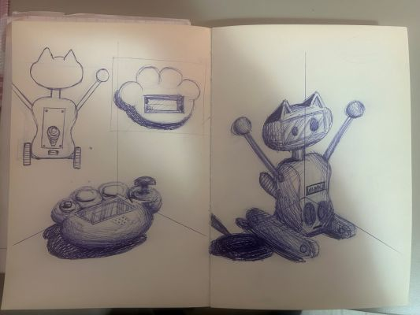
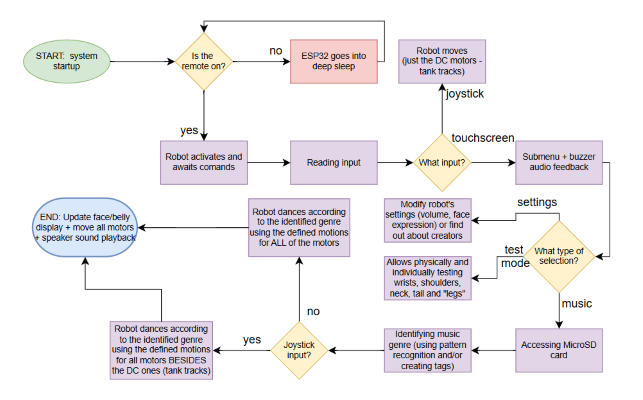
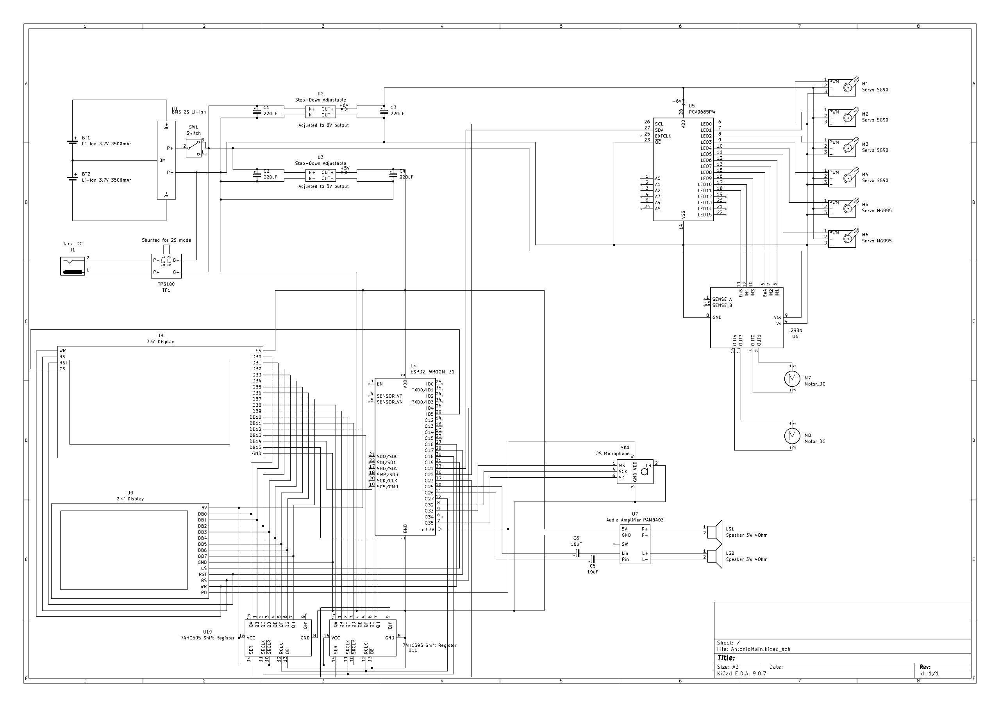
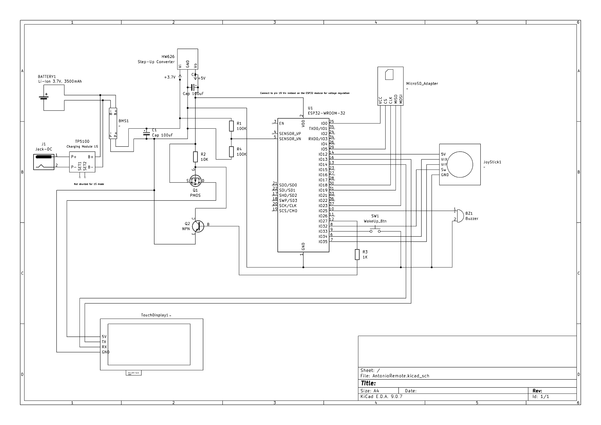

# Antonio
Final project for "Introduction to Robotics" (2025–2026), focused on interactive robotics, audio-driven behavior, and custom human–robot interaction.  

Project by Andrei Cosmin Petru, Pincu Victor Andrei and Vraciu Mara Alina

## DESCRIPTION 
This project brings together two complementary builds into one cohesive system. There will be a robot moving on tank tracks and a touch screen remote that controls it.  

The robot is responsible for autonomous behavior, movement, and audio-visual feedback, while the remote provides an intuitive and playful human–robot interface.

### ABOUT ROBOT
The robot "ANTONIO" features a red panda–inspired designed for expressive and interactive behavior. ANTONIO will be equipped with a speaker capable of playing multiple music genres. For each music category, the robot will perform a specific “emote” by coordinating movements of its hands, head, tail, and “legs,” allowing it to dance according to the music.  

ANTONIO can move when the user interacts with a remote controller. If the user chooses to control the robot’s movement while it is dancing, they will have full control over its direction. Otherwise, ANTONIO will move autonomously based on the selected music genre.  

The robot includes an integrated microSD card on which music files can be downloaded and stored. Two music recognition methods are planned. The first method relies on manually assigned tags that define the genre of each song. The second method uses basic pattern recognition by analyzing drum rhythms, aiming to provide a lightweight and feasible genre classification approach.  
  
ANTONIO features two visual output elements:
- a face display used to show animated expressions
- a belly display that provides real-time audio visualization reacting to the rhythm and intensity of the music

#### 1. HANDS
  - wrists: 
    - up-down movement controlled by a servo motor and a gear mechanism
    - range is approximately 180°
  - shoulders: 
    - rotational movement driven by servo motors
    - range is up to 270°
2. HEAD:
  - neck: up-down movement controlled by a servo motor and a gear mechanism

3. TAIL: up-down movement controlled by a servo motor and a gear mechanism
  
4. LEGS: movement is achieved using tank tracks powered by DC motors
  - forward and backward motion : both tracks rotate at the same speed in the same direction
  - left and right turns: steering is performed using differential drive (one track moves while the other remains stationary)

### ABOUT REMOTE
The remote controller serves two main purposes: controlling the robot's movement and selecting various settings.  

The proposed design of the remote is inspired by a red panda paw, matching the robot’s red panda–inspired visual identity. This design was chosen to make the interaction playful, intuitive, and visually distinctive. At the center of the controller, a touch display will be integrated for menu navigation and visual feedback.  

An on/off power button will be placed on the tip of the pinky finger. The thumb fingertip will include a joystick used for controlling the robot's movement. Additionally, a buzzer will be integrated into the index finger, providing audio feedback when selecting or confirming menu options.  

1. MOVEMENT 
  - the robot's direction is controlled using a joystick located on the thumb
  - the joystick allows forward, backward, and left/right movement 
2. SETTINGS
  - volume: allows adjusting the volume 
  - music: allows selecting different tracks
  - face expression: allows changing ANTONIO's face from the established options
  - test mode: allows testing each moving component individually
  - about creators: shows info about the creators of ANTONIO :
    - Vraciu Mara-Alina - https://github.com/mara131313
    - Andrei Cosmin Petru - https://github.com/cosmo1avo
    - Pincu Victor Andrei - https://github.com/PincuVictor  

## BILL OF MATERIALS 
### ROBOT:
    - 4 x SG90 Servo motors
    - 2 x MG995 Servo motors
    - 2 x DC motors 125:1 Gear ratio
    - ESP32
    - Servo driver PCA9685
    - Charging module TP5100
    - Audio amplifier module PAM8403
    - 2 x Speaker 3W 4Ω
    - Microphone module
    - 2 x Samsung 18650 Li-ion 3.7V battery
    - Module slot card microSD
    - Module BMS Li-ion 2s 7.4V 20A
    - DC power jack adaptor
    - 2 x Voltage regulator buck converter LM2596
    - Dual H-bridge L298N
    - TFT/OLED display
    - OLED Display

### REMOTE:
    - Touch Display (NX4024K032_011)
    - ESP32 
    - 1 x Samsung 18650 Li-ion 3.7V battery
    - Charging module TP5100
    - Voltage regulator boost converter HW626
    - Buzzer
    - Capacitor
    - Joystick
    - Module BMS Li-ion 3.7V 20A
    - DC power jack adaptor

## Features
### ROBOT
- Audio-driven dancing behavior based on music genre
- Real-time audio playback from microSD card
- Music genre recognition system
- Expressive animated face display
- Real-time audio-reactive belly visualization
- Coordinated multi-servo movement (hands, head, tail)
- Differential drive tank-track locomotion
- Autonomous movement based on selected music genre
- Manual movement override via remote controller
- Modular and expandable hardware architecture

### REMOTE
- Touchscreen-based menu navigation
- Joystick-based movement control
- Audio feedback via integrated buzzer
- Visual feedback through touch display
- Wireless Bluetooth communication with the robot

### SYSTEM
- Concurrent handling of motors, audio, and displays
- Real-time human–robot interaction

## QUESTIONS
### 1. What is the system boundary?
For the robot:
  - inside: ESP32, all motors, OLEDs, Audio (Speaker, Amp), Battery and physical chassis/tracks.
  - outside: the floor, obstacles and the bluetooth signal from the remote.

For the remote:
  - inside: ESP32, Touchscreen, joystick, push button and an internal battery.
  - outside: the user (human) and the bluetooth signal being sent to the robot.

### 2. Where does intelligence live?
Primary intelligence lives in the robot, which processes input from the remote and makes decisions related to movement, audio playback, and visual feedback.

### 3. What is the hardest technical problem?
The hardest technical problem will be system concurrency. Having a lot of motors, audio and updating the display  will make synchronization more difficult, therefore creating blocking problems if not handled properly. 

### 4. What is the minimum demo?

The minimum demo will be showing moving on tank tracks. The movement is controlled by the touchscreen remote. Ideally, in this prototype we will be able to play at least one track on the speaker and react to it.

### 5. Why is this not just a tutorial?
This is not just a tutorial because we are making our own designs for the robot's design and movement, our own interface for the remote, and our own unique interactions. This tutorial would have to include days worth of footage to cover the steps.

### 6. Do you need an ESP32?
 Yes, we will be needing 2 ESP32.

## ROUGH SKETCH

## IMPLEMENTATION DETAILS
This section outlines the realization of the project, transitioning from initial concepts to the fully functional physical prototype.

### 3D DESIGN & MODELING
The physical structure of both ANTONIO and the remote was modeled from scratch to adhere to the Red Panda aesthetic while ensuring mechanical robustness.
- **Robot Chassis, Arms, and Head:** Engineered to house dual Li-ion batteries, speakers, the visualizer screen, ESP32, H-bridge motor driver, breadboards, shift registers, amplifier, microphone, and DC motors (driving the master/slave wheels and tracks). The design integrates a charging module, BMS, voltage regulators, and a 3.5-inch display, while providing sturdy anchor points for the 6 servos controlling the arms, head, tail, and paws.
- **Locomotion System:** Custom-designed sprocket wheels and track links, 3D printed to ensure optimal grip and smooth differential steering.
- **Remote Casing:** Modeled as a stylized paw, prioritizing ergonomics for joystick manipulation and touchscreen visibility. The enclosure accommodates a Li-ion battery, ESP32, switch button, touchscreen (with stylus), charging module, BMS, buzzer, voltage regulator, and microSD card slot.
- **Lead Designer:** **Andrei Cosmin-Petru** is responsible for designing and modeling all custom 3D components for the project.

### REMOTE INTERFACE (GUI)
The remote serves as the command center, featuring a custom Graphical User Interface (GUI) tailored for the touch display.
- **Menu Structure:** Organized into intuitive pages (Test Mode, Settings, Music) with large, touch-friendly elements. It includes configuration settings for both ANTONIO and the remote, enabling customizations such as facial expressions and theme songs. The music tab features a scrollable list of 20 songs, displays random custom artwork for each track, and includes playback controls (pause/resume, next, previous).
- **User Feedback:** Provides immediate visual updates on the screen and audio cues via the integrated buzzer when commands are registered.
- **Data Transmission:** Encodes user inputs (drive vectors, volume states, emote requests) into optimized data packets sent wirelessly to the robot.
- **Lead Developer (Interface):** **Vraciu Mara Alina** is responsible for designing and implementing the custom, intuitive user interface.

### FIRMWARE & CONTROL LOGIC
The "brain" of the robot is designed to handle high-concurrency requirements, ensuring that music playback remains uninterrupted while the robot dances or moves.
- **Dual-Core Architecture:** Leverages the ESP32's dual cores to separate blocking tasks (Audio decoding, WiFi/ESP-NOW communication on Core 0) from real-time operations (Motor control, Servo choreography, Display updates on Core 1).
- **Audio-Motion Synchronization:** Utilizes specific algorithms to translate music genres into distinct servo choreographies.
- **State Management:** Implements a robust state machine that seamlessly switches between "Autonomous Dance Mode" and "Manual Override" instantly upon detecting joystick input.
- **Lead Developer:** **Pincu Victor Andrei** is responsible for component selection and the electrical design strategy, ensuring optimal power distribution and operational safety. He also developed the hardware logic and communication between modules using FreeRTOS.

### ASSEMBLY & INTEGRATION
The final build focused on reliable power distribution and the compact integration of all components.
- **Power Management:** Integration of BMS modules and buck converters to supply stable, isolated voltage levels for the logic units (3.3V/5V) and high-torque motors (7.4V).
- **Wire Routing:** Strategic internal cable management to prevent interference with moving parts, particularly around the rotating shoulder and neck mechanisms.
- **Component Mounting:** Secure placement of the PCA9685 driver and L298N motor controller to ensure vibration resistance and effective heat dissipation.
- **Assembly Team:** All three creators are responsible for the physical assembly of the project, including soldering, surface finishing (sanding), component placement, and final system integration.

## DIAGRAMS

