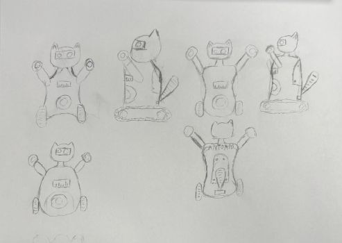
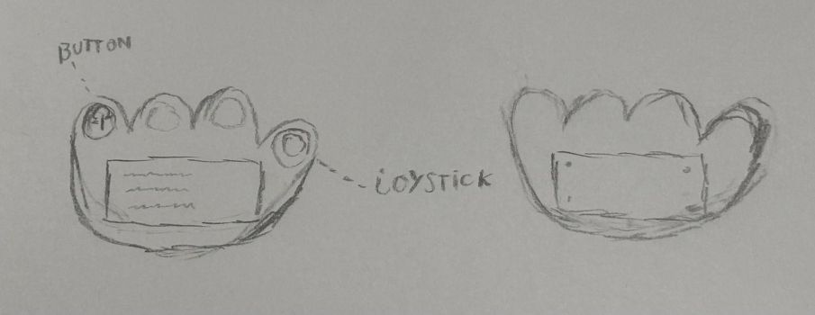

# Antonio
Final project for "Introduction to Robotics" 2025-2026

## DESCRIPTION 
This project brings together two complementary builds into one cohesive system. There will be a robot moving on tank tracks and a touch screen remote that controls it.

### ABOUT ROBOT
The robot "ANTONIO" will have a speaker that plays different genres of music. The robot will have an "emote" for each category using its hands (shoulders and wrists), head (basically the neck), tail and "legs" to dance. ANTONIO can move when the user interacts with the remote. If the user decides they want to make ANTONIO move while dancing, then they will take control over the direction. Otherwise, ANTONIO will move according to the selected genre.

1. HANDS 
  - wrists: 
    - movement is up and down, controlled by a servo motor and a gear
    - range is about 180°
  - shoulders: 
    - movement is a full  rotation by a stepper motor.
    - range is 360°
2. HEAD:
  - neck: movement is up and down, controlled by a servo motor and a gear
3. TAIL: movement is up and down, controlled by a servo motor and a gear
4. LEGS: movement is made with tank tracks using dc motors.
  - forward and backward : both tracks rotate at the same speed in the same direction
  - left and right : steering with differential drive ( one track moves, the other remains stationary)

### ABOUT REMOTE
The remote is used for two main purposes: controlling the movement of the robot and selecting different settings. The proposed design for the remote is a red panda paw. In the middle of it there will be a touch display. To start, on the fingertip of the pinky, there will be an on/off switch for powering it up. The fingertip of the thumb will have a joystick to control the movement. 

1. MOVEMENT 
  - to control the direction in which Antonio will go, a joystick will be used.
2. SETTINGS
  - volume: allows changing the volume 
  - music: allows selecting different tracks
  <!-- - face expression: allows changing ANTONIO's face from established options -->
  - test: allows testing each moving component
  - about creators: shows info about each creator of ANTONIO (Vraciu Mara-Alina - https://github.com/mara131313, Andrei Cosmin Petru - https://github.com/cosmo1avo, Pincu Victor Andrei - https://github.com/PincuVictor) 

## BILL OF MATERIALS 
### ROBOT:
    - 2 x Stepper motors
    - 4 x Servo motors
    - 2 x DC motors
    - ESP32
    - Motor driver 
    - Charging module BMS TP100
    - Audio amplifier module XS9871
    - 2 x LiPo batteries
    - SD Card reader

### REMOTE:
    - Touch Display (NX4024K032_011)
    - ESP32 
    - LiPo battery
    - Voltage regulator
    - Buzzer
    - LED (not sure)
    - Capacitor
    - Joystick

## QUESTIONS

### 1. What is the system boundary?
For the robot:
  - inside: ESP32, all motors, OLEDs, Audio (Speaker, Amp), Battery and physical chassis/tracks
  - outside: the floor, obstacles and the bluetooth signal from the remote

For the remote:
  - inside: ESP32, Touchscreen, joystick, on/off switch and an internal battery
  - outside: the user (human) and the bluetooth signal being sent to the robot

### 2. Where does intelligence live?
Intelligence lives in the robot, taking actions based on the remote's input

### 3. What is the hardest technical problem?
 The hardest technical problem will be communicating all the different input from the remote to the robot clearly

### 4. What is the minimum demo?

The minimum demo will be showing moving on tank tracks. The movement is controlled by the touchscreen remote. Ideally, in this prototype we will be able to play at least one track on the speaker.

### 5. Why is this not just a tutorial?
This is not just a tutorial because we are making our own designs for the robot's design and movement, our own interface for the remote, and our own unique interactions. This tutorial would have to include days worth of footage to cover the steps.

### 6. Do you need an ESP32?
 Yes, we will be needing 2 ESP32.

## ROUGH SKETCHES
### FOR ANTONIO

### FOR THE REMOTE

